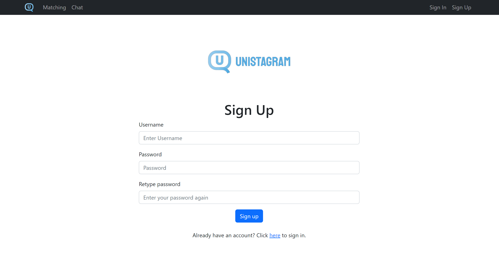
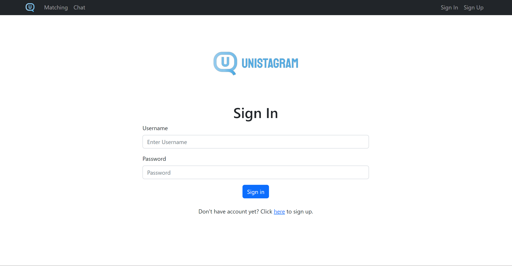
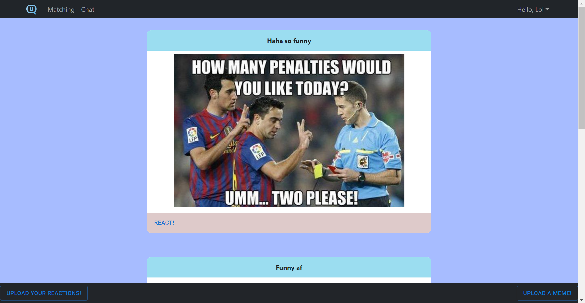
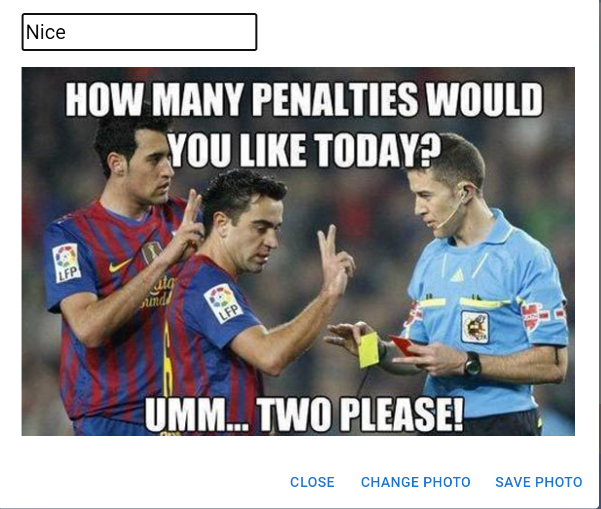
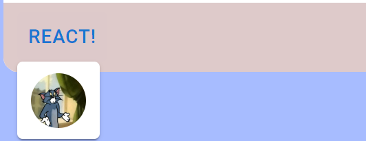
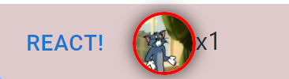
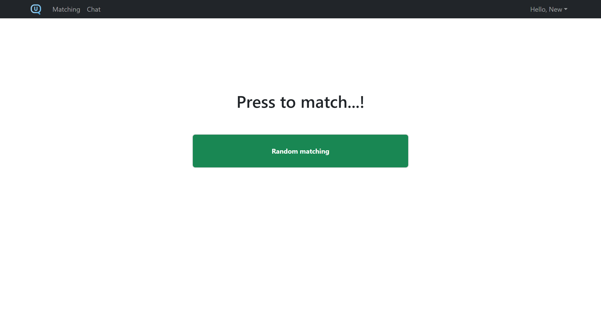
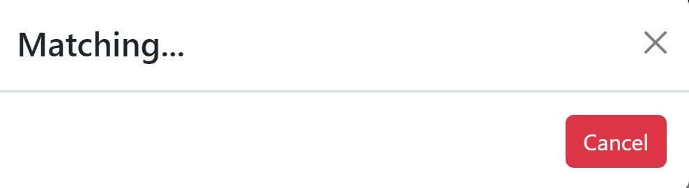
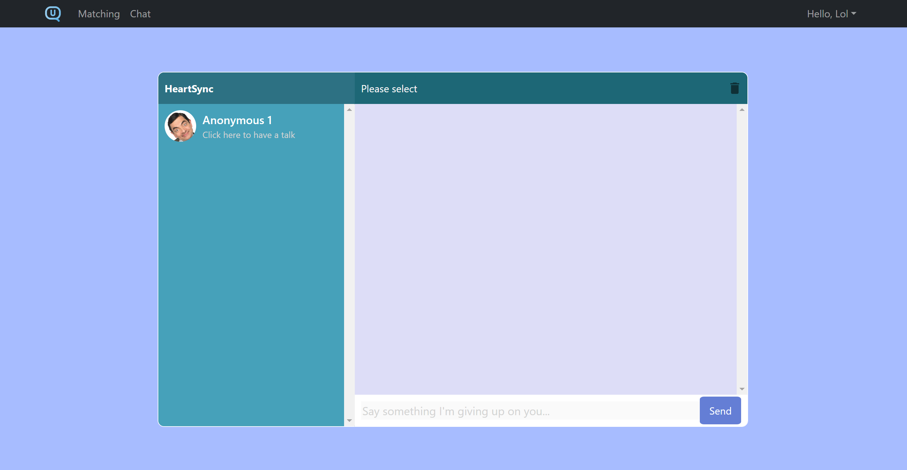
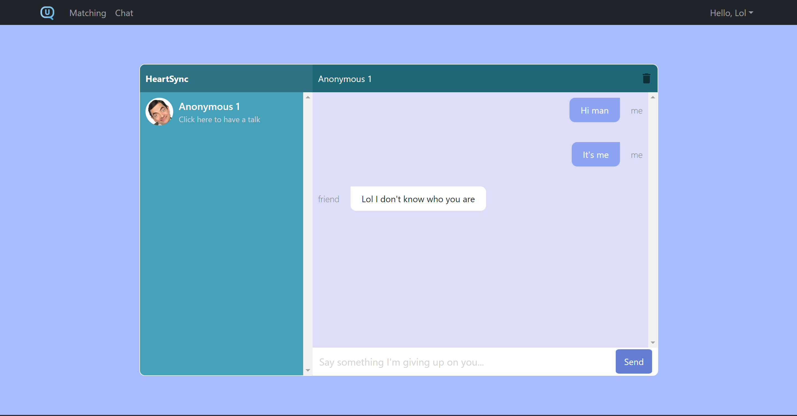

# UNISTAGRAM

## Introduction
UNISTAGRAM is a platform that allow UNISTARSs to match with an anonymous user to have a chat. UNISTAGRAM also has a memefeed where users can upload memes to share laughter among the UNIST community. 

## Contents

* [Features](#features) : A brief introduction to our system's features.

# Features

* [Chatting](#chatting): Sending and querying the messages according to users' conversation. The identities of both parties are not disclosed (remain anonymous) to each other throughout the entire session.

* [Matching](#matching): Matches 2 users randomly to form a new anonymous conversation. 

* [MemeFeed](#memefeed): Provides an active and interactive meme feed so that everyone can share memes, or about anything one’s heart may desire. This is our main page.

* Each feature reside on its own page and we will discuss about it more in-depth in the section below.
  
# Description of each Page

For better user experience, we will explain each page of our website according to user flow.

## Navigation Bar

Our website will always have a Navigation bar on the top, each element in the navigation bar is: Logo (Access main page), Matching, Memefeed, Sign in, and Sign up.


## Sign Up

To use our platform, you should first sign up. The signup display should look like below: 



After signing up, a pop up message will show up saying that you have succesfully signed up and you will be redirected to the sign in page.

## Sign in

The sign in display: 



## MemeFeed
After logging in, you will be redirected to our main page, which is the memefeed. 

This is how our memefeed should look like: 



There are a few features in the memefeed that we will explain below. 

### Upload Meme

In the lower right coner, you can see an upload meme button. Since now you are an user who is logged in, you can freely browse our memefeed, and of course, upload your own memes!

To upload you memes, simply click the button, select your meme from your device, and add a caption to it: 



In addition to posting memes, user can also "react" to the meme by choosing among various customized reactions created by other users.

### Reactions and Reaction upload

Of course, we always have reactions to a specifc post. For this, we add a button called `React!` in every post so that you can react to a post. Additionally, we allow you to choose your own reaction!

#### Upload your own Reaction
We have a button in the lower left corner that will allow you to upload your reaction. The way to load is similar to uploading a meme. However, after uploading, when you click the `React!` button, you will see your own, exclusive, uploaded reaction: 



For example, I uploaded a tom picture as a reaction. And if I react, I can click on the reaction and it will show my reaction:



The number of reaction of the same type can increase because others may want to react the same thing as well. Red circle indicates that this reaction belongs to you, click on the reacted reaction to retract the reaction.

## Matching
Before heading to an anonymous conversation, you need to be matched first. Our matching feature matches 2 users randomly to form a new anonymous conversation. Click on the `Matching` button at the [Navigation Bar](#navigation_bar) to go to the matching page

The matching page should look like this: 



Click on the `Random matching` button will show a pop up like this:



If the queue is non-empty(at least 1 more person is waiting to be matched), then you will be matched with an anonymous person and you will be able to enroll in an anonymous chat (you will be redirected to the chat page). 


## Chatting
In our application, the identities of both parties are not disclosed (remain anonymous) to each other throughout the entire session (unless you want to tell the other person who you are). 

The interface of our chatting page is: 



Now you can select a conversation (you can have multiple conversations at the same time) from the left bar and have a chat: 



To end a conversation, click the `bin` button on the upper right of the chat box. The conversation will disappear. 


# API Documentation

## Chat app

* ### Query Messages In Conversation


<details>
<summary>Returns the list of messages given a conversation ID.</summary>

* URL:

    `/messages/:id`

* Method:

  `GET`

* URL Params:

  **Required**:
  - `id=[string]` : The conversation ID

* Data Params:

  None

* Success Response:

  - Code: 200

    Content:
```json 
[ {
  "id" : "646089d9041dea27617b717f",
  "conversation" : "645e37b871927a11886bc874",
  "sender" : "64299cd2b2afe565a469ebbf",
  "receiver" : "642b007f78fa427e80e8e3dd",
  "content" : "Hi~ Nice to meet u~",
  "timestamp" : 1684117781004
}, {
  "id" : "646089de041dea27617b7180",
  "conversation" : "645e37b871927a11886bc874",
  "sender" : "64299cd2b2afe565a469ebbf",
  "receiver" : "642b007f78fa427e80e8e3dd",
  "content" : "hi!",
  "timestamp" : 1684117781004
},
...
]
```

* Sample Call:

Returns a list of messages in the conversation with the ID of `645e37b871927a11886bc874`.
```bash
curl -X GET localhost:8080/messages/645e37b871927a11886bc874
```


</details>


* ### Send Message To Conversation

<details><summary>Send a new message to the given conversation. The API will return the newly sent message.
</summary>


* URL:

    `/messages/send`

* Method:

  `POST`

* URL Params:

  None

* Data Params:

  **Required**:
  - `conversation=[string]` : The conversation ID that this message belongs
  - `sender=[string]` : The ID of the sender
  - `content=[string]` : The main content of the message

* Success Response:

  - Code: 200

    Content:
```json
{
  "id" : "64619c77410d4207a6b45518",
  "conversation" : "645e38253d6d8e1ff0a3b11e",
  "sender" : "64299cd2b2afe565a469ebbf",
  "receiver" : "64299cd2b2afe565a469eba6",
  "content" : "I want to sleep~",
  "timestamp" : 1684118647784
}
```

* Error Response:

  - Code: 404 Not Found

    Content: `"Conversation does not exist!"`

  - Code: 406 Not Acceptable

    Content: `"Conversation has been terminated!"` or `"Sender is not in this conversation!"`

* Sample Call:

Returns the newly sent message.
```bash
curl -X POST localhost:8080/messages/send -H 'Content-type:application/json' -d '{"conversation": "645e38253d6d8e1ff0a3b11e", "sender": "64299cd2b2afe565a469ebbf", "content": "I want to sleep~"}'
```

</details>


* ### Query All Conversations
<details><summary>Return all conversations in the database.</summary>


* URL:

    `/conversations/`

* Method:

    `GET`

* URL Params:

    None

* Data Params:

    None

* Success Response:

    - Code: 200

        Content: 
```json
[ {
  "id" : "645e37b871927a11886bc874",
  "client1" : "64299cd2b2afe565a469ebbf",
  "client2" : "642b007f78fa427e80e8e3dd",
  "status" : "ONGOING"
}, {
  "id" : "645e38253d6d8e1ff0a3b11e",
  "client1" : "64299cd2b2afe565a469eba6",
  "client2" : "64299cd2b2afe565a469ebbf",
  "status" : "TERMINATED"
},
...
]
```

* Sample Call:

Returns the all conversations in the database.
```bash
curl -X GET localhost:8080/conversations/
```
</details>


* ### Query A Conversations


<details><summary>Return the conversation's information.</summary>

* URL:

    `/conversations/:id`

* Method:

    `GET`

* URL Params:

    **Required**:
    - `id=[string]` : The conversation ID

* Data Params:

    None

* Success Response:

    - Code: 200

        Content: 
```json
{
  "id" : "645e37b871927a11886bc874",
  "client1" : "64299cd2b2afe565a469ebbf",
  "client2" : "642b007f78fa427e80e8e3dd",
  "status" : "ONGOING"
}
```

* Error Response:

    - Code: 404 Not Found

        Content: `"Conversation id does not exist!"`

* Sample Call:

Return the conversation's information.
```bash
curl -X GET localhost:8080/conversations/645e37b871927a11886bc874
```
</details>


* ### Query Conversations By User

<details><summary>Return a list of conversations that the user participates in.
</summary>


* URL:

    `/conversations/users/:id`

* Method:

    `GET`

* URL Params:

    **Required**:
    - `id=[integer]` : The user ID

* Data Params:

    None

* Success Response:

    - Code: 200

        Content: 
```json
[ {
  "id" : "645e37b871927a11886bc874",
  "client1" : "64299cd2b2afe565a469ebbf",
  "client2" : "642b007f78fa427e80e8e3dd",
  "status" : "ONGOING"
}, {
  "id" : "645e38253d6d8e1ff0a3b11e",
  "client1" : "64299cd2b2afe565a469eba6",
  "client2" : "64299cd2b2afe565a469ebbf",
  "status" : "TERMINATED"
},
...
]
```

* Error Response:

    - Code: 404 Not Found

        Content: `"User id does not exist!"`

* Sample Call:

Return the conversation's information.
```bash
curl -X GET localhost:8080/conversations/users/1
```
</details>


* ### End Conversation

<details><summary>Terminate the conversation.
</summary>


* URL:

    `/conversations/end/:id`

* Method:

    `PUT`

* URL Params:

    **Required**:
    - `id=[string]` : The conversation ID

* Data Params:

    None

* Success Response:

    - Code: 200

        Content: 
```json
{
  "id" : "645e38253d6d8e1ff0a3b11e",
  "client1" : "64299cd2b2afe565a469eba6",
  "client2" : "64299cd2b2afe565a469ebbf",
  "status" : "TERMINATED"
}
```

* Error Response:

    - Code: 404 Not Found

        Content: `"Conversation ID does not exist!"`

* Sample Call:

Return the conversation's information.
```bash
curl -X PUT localhost:8080/conversations/end/645e38253d6d8e1ff0a3b11e
```
</details>


---

## Matching app

* ### Update a user to join the waiting queue

<details><summary>Add a user to the waiting queue for conversation.
</summary>


* URL:

    `/matching/join_queue/:id`

* Method:

    `PUT`

* URL Params:

    **Required**:
    - `id=[string]` : The user ID

* Data Params:

    None

* Success Response:

    - Code: 200

        Content: 
```json 
{
  "id" : "646076867f96a723e9a3f204",
  "user_id" : 3000,
  "age" : 25,
  "gender" : "M",
  "is_in_queue" : true
}
```
* Error Response:

    - Code: 404 Not Found

        Content: `"User id does not exist!"`

    - Code: 406 Not Acceptable

        Content: `"Parameter is not a number!"`

* Sample Call:

Add to the waiting queue a user with the id `3000`.
```bash
curl -X PUT localhost:8080/matching/join_queue/3000
```
</details>


* ### Remove a user from the waiting queue

<details><summary>Remove the user from the waiting queue
</summary>


* URL:

    `/matching/out_queue/:id`

* Method:

    `PUT`

* URL Params:

    None

* Data Params:

    **Required**:
    - `id=[string]` : The user ID

* Success Response:

    - Code: 200

        Content: 
```json
{
  "id" : "646076867f96a723e9a3f204",
  "user_id" : 3000,
  "age" : 25,
  "gender" : "M",
  "is_in_queue" : false
}
```

* Error Response:

    - Code: 404 Not Found

        Content: `"User id does not exist!"`

    - Code: 406 Not Acceptable

        Content: `"Parameter is not a number!"`

* Sample Call:

Remove from the queue a user with the id `3000`.
```bash
curl -X PUT localhost:8080/matching/out_queue/3000
```
</details>


* ### Check if the user is in the queue
<details><summary>Check whether a user id are in the waiting queue for matching.</summary>

* URL:

    `/matching/check_in_queue/:id`

* Method:

    `GET`

* URL Params:

    None

* Data Params:

    **Required**:
    - `id=[string]` : The user ID

* Success Response:

    - Code: 200

        Content: 
```json
{
  "is_in_queue" : true/false
}
```

* Error Response:

    - Code: 404 Not Found

        Content: `"User id does not exist!"`

* Sample Call:

Returns the status `is_in_queue` of the user
```bash
curl -X GET localhost:8080/matching/check_in_queue/3000
```
</details>

---

## Memefeed app

* ### Post a meme 

<details>
<summary>
Upload a new meme
</summary>

* URL:

    `/memes`

* Method:

    `POST`

* URL Params:

    None

* Data Params:

    **Required**:
    - `title=[string]` : The title of the posted meme
    - `image=[@path/to/meme]` : The address of the meme 
    - `author=[string]` : The user who posted the meme 

* Success Response:

    - Code: 200

        Content: 
```json 
{
  "id" : "6461c3919e67e01f498aa6f0",
  "title" : "Meme",
  "image" : {
    "type" : 0,
    "data" : <data>
  },
  "author" : "Jay",
  "timestamp" : 1684128657972
}
```

* Sample Call:

Add to the database a meme with the title `Meme`, path: `@data/meme_test.png`, and author `Jay`:
```bash
curl -X POST localhost:8080/memes -H "Content-Type:multipart/form-data" -F "title=Meme" -F "image=@data/meme_test.png" -F "author=Jay"
```
Make sure to run this in the project directory `/UNISTAGRAM`.
</details>

* ### Get a meme by its id

<details>
<summary>
Query the meme by a given ID.
</summary>

* URL:

    `/memes/:id`

* Method:

    `GET`

* URL Params:

    **Required**:
    - `id=[string]` : The meme ID

* Data Params:

    None

* Success Response:

    - Code: 200

        Content: 
```json 
{
  "id" : "6461c3919e67e01f498aa6f0",
  "title" : "Meme",
  "image" : {
    "type" : 0,
    "data" : <data>
  },
  "author" : "Jay",
  "timestamp" : 1684128657972
}
```

* Error Response:

    - Code: 404 Not Found

        Content: `"The meme id does not exist!"`


* Sample Call:

Get from the database the meme with the id `6461c3919e67e01f498aa6f0`.
```bash
curl -X GET localhost:8080/memes/6461c3919e67e01f498aa6f0
```
</details>

* ### Save Reaction

<details>
<summary>
This feature is created to allow users to upload their own reaction to memes
</summary>

* URL:

    `/reactions`

* Method:

    `POST`

* URL Params:

    None

* Data Params:

    **Required**:
    - `title=[string]` : The title of the uploaded reaction
    - `image=[@path/to/meme]` : The path to the reaction
    - `author=[string]` : The user who posted the reaction

* Success Response:

    - Code: 200

        Content: 
```json
{
  "id" : "6461c9989e67e01f498aa6f1",
  "title" : "Reaction",
  "image" : {
    "type" : 0,
    "data" : <data>
  },
  "author" : "Garrick",
  "timestamp" : 1684130200614
}
```

* Sample Call:

Add to the database a meme with the title `Reaction`, path: `@data/reaction_test.png`, and author `Garrick`:
```bash
curl -X POST localhost:8080/reactions -H "Content-Type:multipart/form-data" -F "title=Reaction" -F "image=@data/reaction_test.png" -F "author=Garrick"
```
Make sure to run this in the project directory `/UNISTAGRAM`.

</details>

* ### Get a reaction by its id

<details>
<summary>
Query a reaction by a given reaction_id
</summary>

* URL:

    `/reactions/:id`

* Method:

    `GET`

* URL Params:

    **Required**:
    - `id=[string]` : The reaction ID

* Data Params:

    None

* Success Response:

    - Code: 200

        Content: 
```json 
{
  "id" : "6461c9989e67e01f498aa6f1",
  "title" : "Reaction",
  "image" : {
    "type" : 0,
    "data" : <data>
  },
  "author" : "Garrick",
  "timestamp" : 1684130200614
}
```

* Error Response:

    - Code: 404 Not Found

        Content: `"The reaction id does not exist!"`


* Sample Call:

Get from the database the reaction with the id `6461c9989e67e01f498aa6f1`.
```bash
curl -X GET localhost:8080/reactions/6461c9989e67e01f498aa6f1
```
</details>

* ### Add Reaction to a meme

<details>
<summary>
Every reaction a user gave to a meme is added.
</summary>

* URL:

    `/meme_reactions/add`

* Method:

    `POST`

* URL Params:

    None

* Data Params:

    **Required**:
    - `meme_id=[string]` : The id of the meme
    - `reaction_id=[string]` : The id of the reaction
    - `user=[string]` : The user who made the reaction

* Success Response:

    - Code: 200

        Content: 
```json 
{
  "id" : "6461cbad9e67e01f498aa6f2",
  "meme_id" : "6461c3919e67e01f498aa6f0",
  "reaction_id" : "6461c9989e67e01f498aa6f1",
  "user_id" : "64299cd2b2afe565a469eba6"
}
```

* Error Response:

    - Code: 409 Conflict 

        Content: `"This user has already reacted to this meme!"`


* Sample Call:

An user with id `64299cd2b2afe565a469eba6` reacted to the meme `6461c3919e67e01f498aa6f0` with the reaction `6461c9989e67e01f498aa6f1`
```bash
curl -X POST localhost:8080/meme_reactions/add/ -F 'meme_id=6461c3919e67e01f498aa6f0' -F 'reaction_id=6461c9989e67e01f498aa6f1' -F 'user_id=64299cd2b2afe565a469eba6'
```
</details>

* ### Get all the reactions that have been given to a meme.

<details>
<summary>
The purpose is self-explanatory
</summary>

* URL:

    `/meme_reactions/:id`

* Method:

    `GET`

* URL Params:

    **Required**:
    - `id=[string]` : The id of the meme
  
* Data Params:

    None

* Success Response:

    - Code: 200

        Content: 
```json 
{
  "6461c9989e67e01f498aa6f1" : 1
}
```

* Sample Call:

Get all reactions that has been given to the meme with meme_id `6461c3919e67e01f498aa6f0`
```bash
curl -X GET localhost:8080/meme_reactions/6461c3919e67e01f498aa6f0
```
</details>

* ### Remove reaction from a meme.

<details>
<summary>
I think it is no longer funny, i want my reaction back!
</summary>

* URL:

    `/meme_reactions/del`

* Method:

    `DELETE`

* URL Params:

    None
  
* Data Params:

    **Required**:
    - `meme_id=[string]` : The id of the meme
    - `reaction_id=[string]` : The id of the reaction
    - `user=[string]` : The user who wants to retract the reaction

* Success Response:

    - Code: 200

        Content: 
```json 
true
```

* Sample Call:

An user with id `64299cd2b2afe565a469eba6` retracts his/her reaction `6461c9989e67e01f498aa6f1` from the meme `6461c3919e67e01f498aa6f0` 
```bash
curl -X DELETE localhost:8080/meme_reactions/del -F 'meme_id=6461c3919e67e01f498aa6f0' -F 'reaction_id=6461c9989e67e01f498aa6f1' -F 'user_id=64299cd2b2afe565a469eba6'
```

</details>
