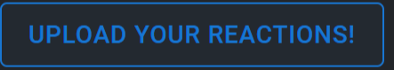
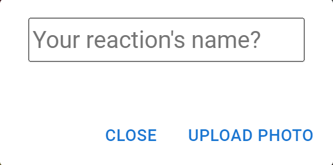

# UNISTAGRAM

## Introduction
UNISTAGRAM is a platform that allow UNISTARSs to match with an anonymous user to have a chat and browse a meme feed constructed by its very users to share laughter among the UNIST community. 

## Contents

* [Features](#features) : A brief introduction to our system's features.

# Features

* [Chatting](#chatting): Sending and querying the messages according to users' conversation. The identities of both parties are not disclosed (remain anonymous) to each other throughout the entire session.

* [Matching](#matching): Matches 2 users randomly to form a new anonymous conversation. 

* [MemeFeed](#memefeed): Provides an active and interactive meme feed so that everyone can share memes, or about anything one’s heart may desire. This is our main page.

* Each feature reside on its own page and we will discuss about it more in-depth in the section below.
  
# Description of each Page

For better user experience, we will explain each page of our website according to user flow.

## Navigation Bar

Our website will always have a Navigation bar on the top, each element in the navigation bar is: Logo (Access main page), Matching, Memefeed, Sign in, and Sign up.

## Sign Up

To use our platform, you should first sign up. The signup display should look like below: 

After signing up, a pop up message will show up saying that you have succesfully signed up and you will be redirected to the sign in page.

## Sign in

The sign in display: 

## MemeFeed
After logging in, you will be redirected to our main page, which is the memefeed. 

This is how our memefeed should look like: 

There are a few features in the memefeed that we will explain below. 

### Upload Meme

In the lower right coner, you can see an upload meme button. Since now you are an user who is logged in, you can freely browse our memefeed, and of course, upload your own memes!

To upload you memes, simply click the button, select your meme from your device, and add a caption to it: 

In addition to posting memes, user can also "react" to the meme by choosing among various customized reactions created by other users.

### Reactions and Reaction upload

Of course, we always have reactions to a specifc post. For this, we add a button called `React!` in every post so that you can react to a post. Additionally, we allow you to choose your own reaction!

#### Upload your own Reaction
We have a button in the lower left corner that will allow you to upload your reaction:

The way to upload is similar to uploading a meme, below is the pop-up for meme uploading: 

After uploading, when you click the `React!` button, you will see your own, exclusive, uploaded reaction: 

For example, I uploaded a tom picture as a reaction. And if I react, I can click on the reaction and it will show my reaction under the meme:

The number of reaction of the same type can increase because others may want to react the same thing as well. Red circle indicates that this reaction belongs to you, click on the reacted reaction to retract the reaction.

## Matching
Before heading to an anonymous conversation, you need to be matched first. Our matching feature matches 2 users randomly to form a new anonymous conversation. Click on the `Matching` button at the [Navigation Bar](#navigation_bar) to go to the matching page

The matching page should look like this: 

Click on the `Random matching` button will show a pop up like this:

If the queue is non-empty (meaning at least 1 more person is waiting to be matched), then you will be matched with an anonymous person and you will be able to enroll in an anonymous chat (you will be redirected to the chat page). 

## Chatting
In our application, the identities of both parties are not disclosed (remain anonymous) to each other throughout the entire session (unless you want to tell the other person who you are). 

The interface of our chatting page is: 

Now you can select a conversation (you can have multiple conversations at the same time) from the left bar and have a chat: 

To end a conversation, click the `bin` button on the upper right of the chat box. The conversation will disappear. 

**Last and not least: Have fun, and prosper!**

For Testing: Please access the localhost:8080 at 1 tab of a browser and access the same localhost:8080 at another tab (incognito tab). In the 2 tabs, log in into 2 different accounts, press `Random Matching` in the Matching page in both accounts to test the realtime anonymous matching and realtime anonymous chatting features. Thank you!

